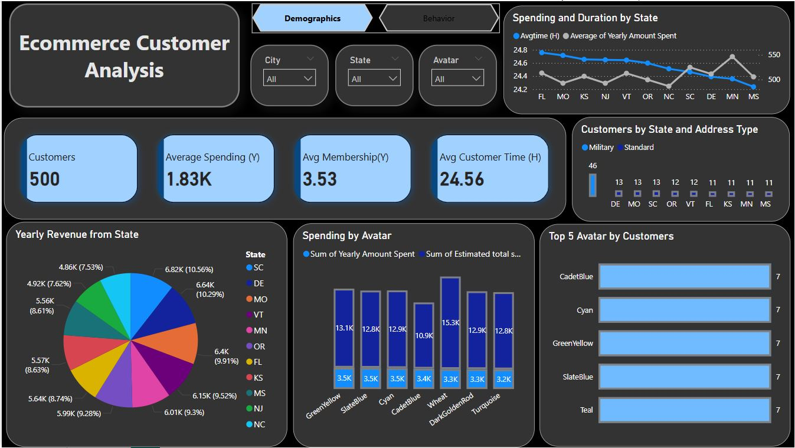

# E-commerce Customer Analysis
Analyze customer demographics and purchasing behavior to  understand the target audience.
 ## Page 1 – Demographics Overview

 
* KPI Tiles: Present high-level metrics such as total number of customers, average spending, average membership duration, and average customer time.

* Spending and Duration by State: Line chart that compares the average customer time and yearly spending across different states.

* Yearly Revenue from State: Pie chart showing the contribution of each state to the total yearly revenue.

* Spending by Avatar: Bar chart illustrating the total yearly spending and estimated total spending across different customer avatars.

* Top 5 Avatars by Customers: Horizontal bar chart displaying the most commonly used avatars by the number of customers.

* Customers by State and Address Type: Bar chart breaking down customers by state and their address type (e.g., Military or Standard).

# Page 2 – Behavior Analysis
* Customers by Address Type: Donut chart showing the distribution of customers based on address type.

* Membership Duration by Yearly Amount Spent: Line chart examining the relationship between the length of membership and annual spending.

* Yearly Amount Spent by Average Time: Scatter plot showing how yearly spending correlates with average customer engagement time, segmented by clusters.

* Average Amount Spent by Duration: Line chart comparing average spending with time spent on different platforms (app vs. website).
